# IT2810 - Project 4
> ***NOTE***: Due to a [bug](https://github.com/facebook/metro/issues/453) in a dependency of `react-native` this project does not run on `Node.js` versions above `v12.10.0`

Mountain Finder is a website with over 1000 mountains with height over 2000 meters. You can search, sort and filter the mountains, and by clicking a specific mountain in the list, a modal appears with detailed mountain data. In this modal, you can rate the chosen mountain from 1-5, and see the total score. The mountain is rated by clicking the number of stars wanted. You can only rate once for every phone (or download instance). 

## Install and Run
The client is set up to use the server on the VM, to use your own server with database one needs to follow the steps below for installing and running the server. One also needs to ensure [`MongoDB`](https://www.mongodb.com/) is installed on the machine and the correct credentials/port number are provided in the [server/index.js](server/index.js) and the [server/initialize-db.js](server/initialize-db.js) when connnecting to the database. On the client side one needs to ensure that one is on the same network as the server (this is valid for using the client out of the box aswell). If the user wants to use a own server one needs to change the remote base address at the top in the [client/api/mountain.js](client/api/mountain.js) file in the client code. For installing and running the client without modifications just follow the steps below.

### Server
```sh
$ cd server
$ npm install
$ npm run init-db
$ npm start
```

### Client
```sh
$ cd client
$ npm install
$ npm start
```

## React Native and reuse code 
React Native was used for this project. To reuse code from the previous project which used React, some changes had to be done. The components from React and React Native does not only have different names, but often different functionality and/or styling too. 

An example of elements with very similar functionality are `div` and `View`. There exists a button element in React Native as in web JS, but the touchable elements like `TouchableOpacity` are much easier to style than the React Native `Button`.

A major difference between React (and normal web development) and React Native is that `StyleSheet` objects are used instead of CSS files. When no CSS file is needed, it lead to the group only using one JS file for each component. 

Other than different components/elements, there were much of the logic that could be reused. The group used hooks and Redux almost without changes from the previous project. 

## Expo
Expo is used for this project to make the development of the React Native applicaton fast and easy. Expo is a platform for making universal applications with React Native that runs on iOS and Android. It has a lot of useful tools that is built around React Native that the group used in this project, such as the `expo-cli` and `@expo/vector-icons`. The group used the expo CLI for installing, initializing and running the project:
```sh
$ npm install --global expo-cli
$ expo init <project-name>
$ cd <project-name>
$ expo start
```
The CLI worked as a provider of the mobile client by using a mobile client of expo on the phones and either scanning a QR-code (which directed to a URL) or by manually inserting a URL in the web browser. This started the downloading of the application to the phone and running it afterwards.
The command line interface also provided fast upload of the application after every save of source files in the project to the devices.

## Redux
`Redux` is used in this project for easy managing the global states needed in the components. This is very useful and prevents "sending" up and down states in the component hierarchy. Redux was used mostly the same way that the group used it for the previous project, but with some modifications to make it better. Redux was used like the previous project by using reducers and actions. For ensuring that the group did not type the names of the global state actions wrong, a [file](client/actionTypes.js) was used for creating the names as constants. Redux was used for storing states about the search value, sorting, pagination, etc.

## AsyncStorage
In this project the group used `AsyncStorage` for storing the user ratings of mountains in the mobile application. AsyncStorage made it possible for persistance data to be stored on the device from one to the next run. `AsyncStorage` works similiar to `LocalStorage` for the web, but is asynchronous and returns a `Promise`. The feature that was implemented is available after searching/filtering/sorting and selecting a mountain to open the modal with the given mountain. Then on the bottom of the modal there is stars that can be used for rating the selected mountain. The user of the application is only available to rate a mountain once, and this is stored in the AsyncStorage and checked every time a mountain is selected. If a selected mountain is already rated by the user of the application, then a message appears to the user above the stars and if the user presses the stars. 

## Git usage and code style
The group used issues with connected branches for the bigger tasks of the project. The commits are marked with which issue they contribute to. 

### Lint
The group used ESLint for linting. To run the linting, use this command in the `server` or `client` directory: 
```sh
$ npm run lint
```

## Testing
### Responsive design and OS

The group tested the application and made sure that the different filtering options worked together, and that they worked with search and sorting. The pagination and rating was tested. The group made sure that AsyncStorage worked as intended, also after reopening the application. 

All of these functionalites were tested on both iOS and Android. There was also done testing of the responsive design, to make sure that it woked well on different device sizes. 

The group tested the application on three different mobile devices, an `iPhone 5s` with `iOS`, a `Samsung Galaxy Tab S2` with `Android` and a `Samsung Galaxy S9+` with `Android`.

There were not many big changes that had to be done to make the application usable on both iOS and Android. The main difference in design is the `Picker` for the filters, as can be seen in Image 2 (iOS) and Image 11 (Android).

Another challenge was to adapt the application to both the iPhone and the Samsung Tab. The iPhone that was used is a very small device, and the tablet is significantly larger. This lead to a lot of small fixes to make the application look good enough on all of the devices. A library with viewport height and width came in handy for this. 

The group did visual testing to make sure that the design looked good on multiple sizes and operating systems. Below are some screenshots from the different devices: 

<div style="text-align: center">
<strong>Image 1 and 2: Iphone 5s</strong><br>
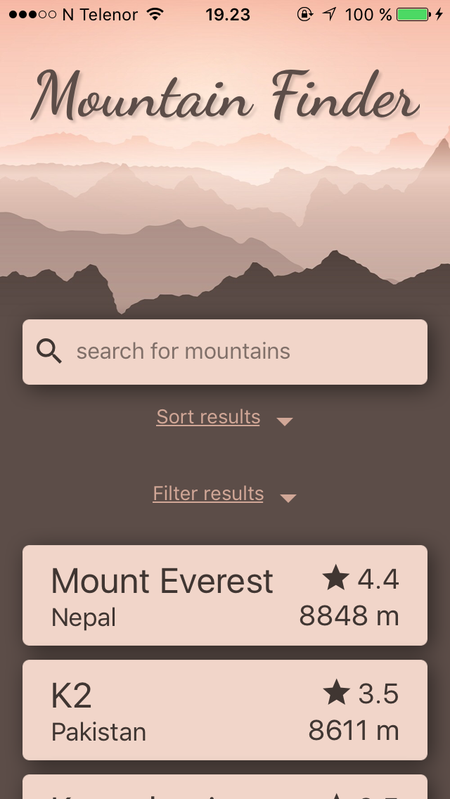 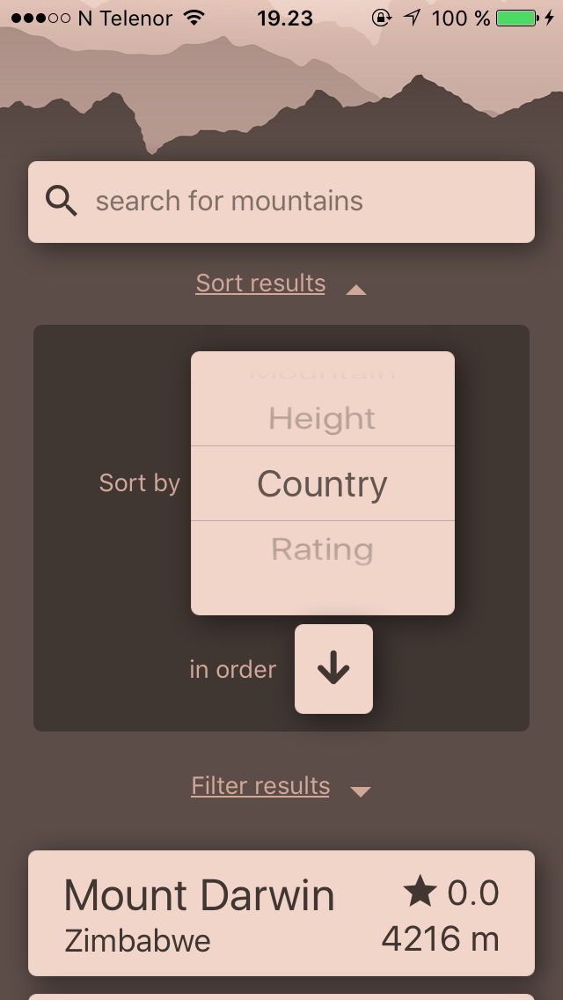<br>

<strong>Image 3 and 4: Iphone 5s</strong><br>
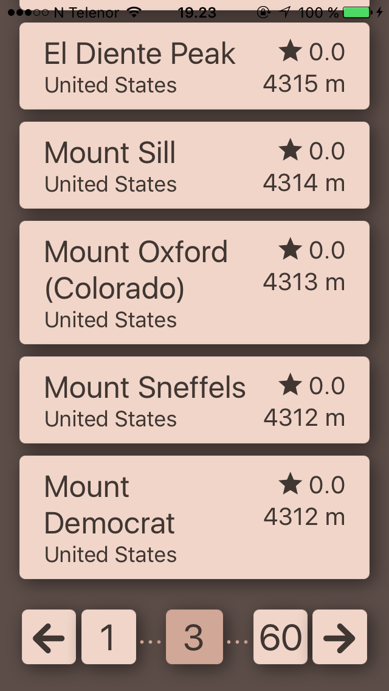 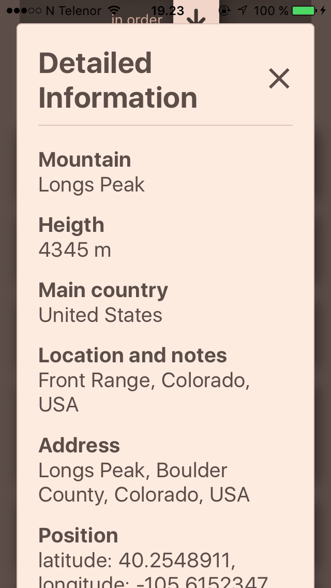

<strong>Image 5: Iphone 5s</strong><br>
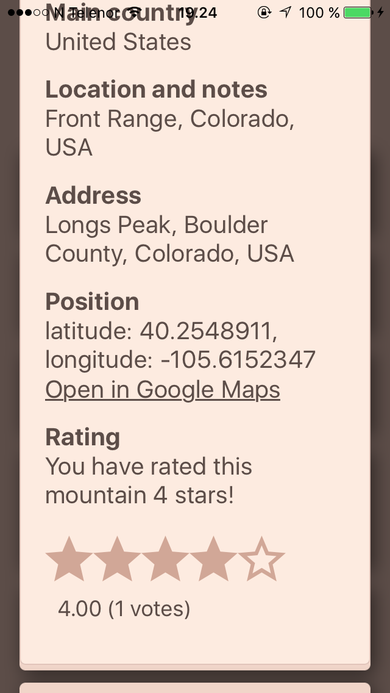 

<strong>Image 6 and 7: Samsung Galaxy S9+</strong><br>
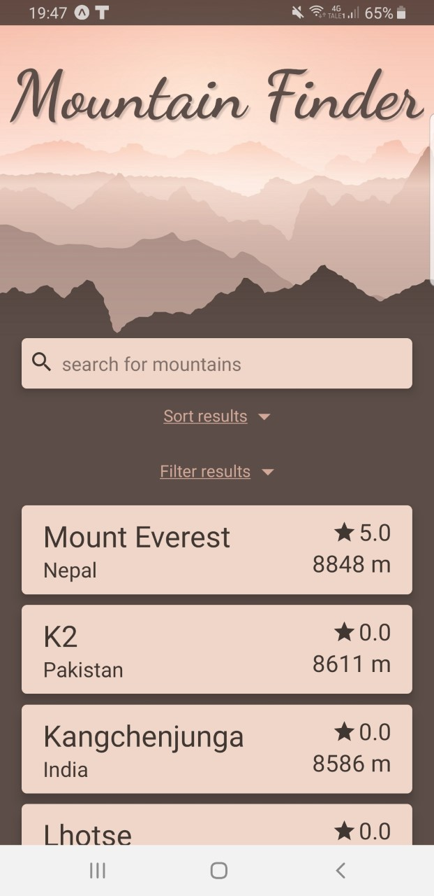 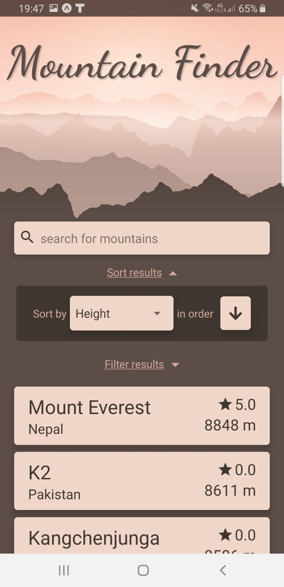<br>

<strong>Image 8 and 9: Samsung Galaxy S9+</strong><br>
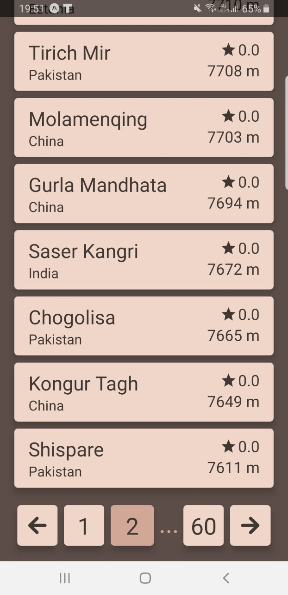 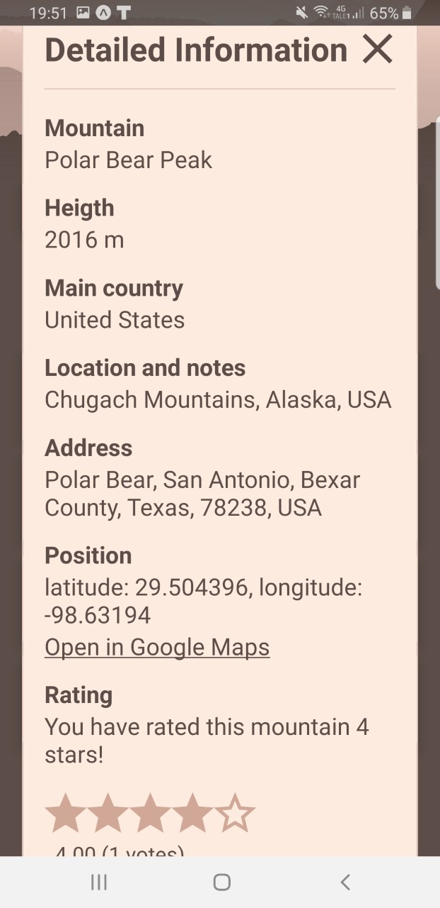<br>

<strong>Image 10 and 11: Samsung Galaxy Tab S2</strong><br>
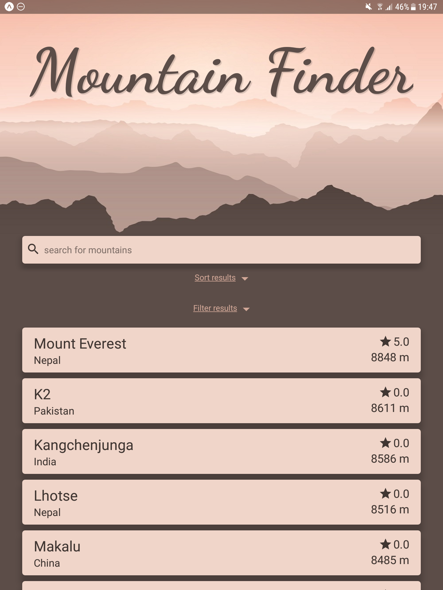 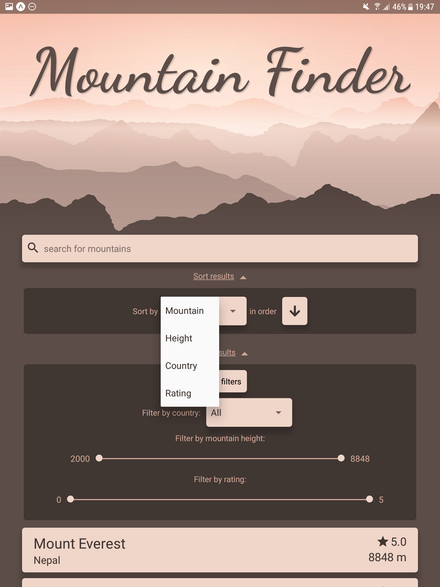<br>

<strong>Image 12 and 13: Samsung Galaxy Tab S2</strong><br>
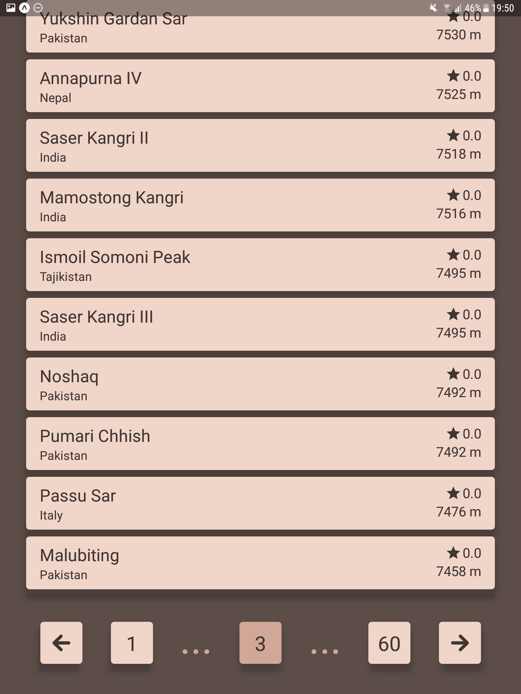 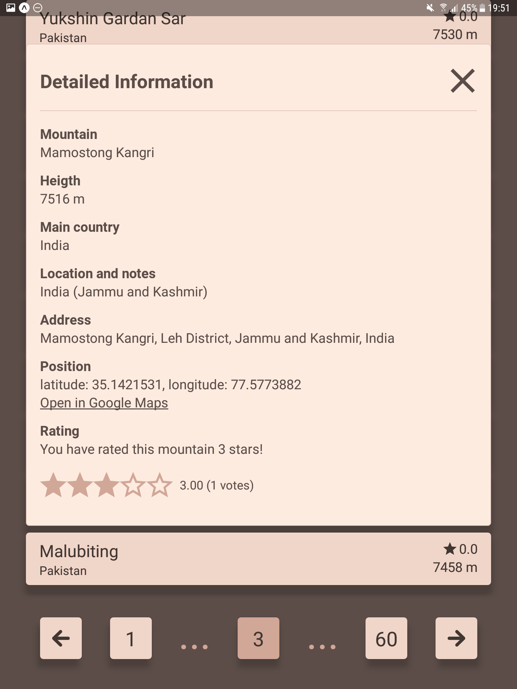<br>
</div>


### Manual end-to-end testing
Below are some scenarios for the manual end-to-end testing. 

#### Scenario 1
Test that two filters can be used on the data at the same time.
1. Filter on country `Australia`.
2. Filter on height from `2000-4060` m.
3. Expect that the list will show the mountain `Mount Walter` first.

#### Scenario 2
Test that sorting is not reset after filtering. 
1. Sort by height. 
2. Click arrow to point up.
3. Expect `Mount Le Conte` to be at the top of the list (with `2010` m height).
4. Filter by only mountains over `8500` m.
5. Expect 4 results where `Lhotse` is at the top and `Mount Everest` (highest mountain) is at the bottom of the list.  

#### Scenario 3
Test that a user only can rate a mountain one time (on the same phone/application instance).
1. Click an unrated mountain to get detailed information.
2. Click at the number of stars wanted to rate.
3. Click `Yes` when getting the alert notification.
4. Expect message `You have rated this mountain _ stars!` to appear above the rating. 
5. Click one of the stars again. 
6. Expect to get alert `You have already voted for this mountain!`.
7. Close and reopen the app.
8. Expect that the rating is saved for the same mountain. 

#### Scenario 4
Test that it is possible to cancel a rating when the alert appears.
1. Click an unrated mountain to get detailed information.
2. Click at the number of stars wanted to rate. 
3. Click `Cancel` when getting the alert notification.
4. Expect no rating to be saved. 

#### Scenario 5
Test that the active page number resets.
1. Go to page number 3.
2. Search for `F`.
3. Expect to be on page number 1.

#### Scenario 6
Test that the pagination works. 
1. Search for `H`.
2. Scroll to the bottom.
3. Expect to see maximum page as 21.
4. Click on page 21.
5. Expect to see `Mount Heng (Shanxi)` as the last mountain.

#### Scenario 7
Test that the application returns no mountains and a message when there are no results.
1. Search for `Donut`. None of the mountains are called that. 
2. Expect to get message `No results!`

#### Scenario 8
Test country searching. 
1. Search for `Norway`.
2. Expect to get three mountains as result.


### Tests
To run server tests from the previous project run these commands: 
```sh
$ cd server
$ npm test
```

## Other Third Party Components and Libraries
In this project the group used less third party components than in the web application project, because `React Native` is a framework rather than `React` which is only a library and it comes with many native components. The group also wanted to have similiar components and styles as to the previous project and therefore did reuse much of the code from that project and could easily replace `<div>` with `<View>`/`<ScrollView>`/etc. and `<p>` with `<Text>`.

### <a href="https://expo.github.io/vector-icons/">@expo/vector-icons Ionicons</a>
`@expo/vector-icons` is a library consisting of many icon packages such as `Ionicons`, `FontAwesome`, `MaterialIcons` and more. In this project the group used the Ionicons from this package, as that was the icons that was used in the previous project. The icons were easily accessible with very similiar names. The icons was used for arrows, search, close and stars.

### <a href="https://github.com/ptomasroos/react-native-multi-slider">react-native-multi-slider</a>
`react-native-multi-slider` is a library for using a slider with two markers on the slider. This is not something that comes with React Native and was very much like another component in functionality that the group used in the previous project. The sliders was used for filtering between height and rating of the mountains.

### <a href="https://github.com/joetakara/react-native-expo-viewport-units">react-native-expo-viewport-units</a>
`react-native-expo-viewport-units` was used for setting the heights and widths much more relative to the device screen size. This was possible by allowing to use `viewport width` (`vw`) and `viewport height` (`vh`). As this is not a feature in React Native itself, it made it much easier to calculate a better responsive size for components accross devices.

## Credits
* Header image is created by <a href="https://www.freepik.com/free-vector/mountain-landscape_4391852.htm"> kjpargeter - Freepik</a>.

* The list of mountains is from <a href="https://en.wikipedia.org/wiki/List_of_mountains_by_elevation"> Wikipedia</a>. 

* Mountain coordinates and country from <a href="https://www.openstreetmap.org">OpenStreetMap</a>.
